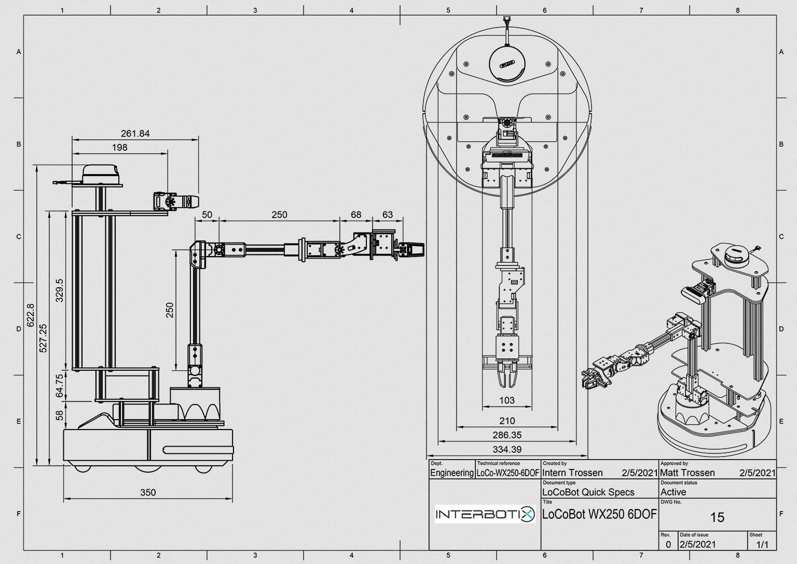
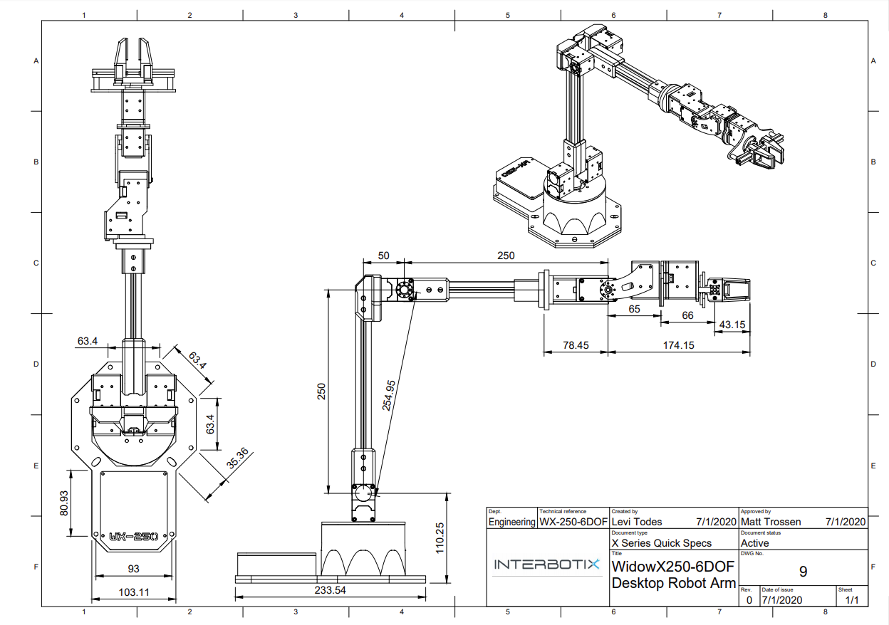

Description of the robot
=============================
This robot is built with 3 parts. 

First Part
-----------
First is the base part. There is two kinds of base robot, e.g. iRobot Create 3 and Kobuki Robot. Here we use Create 3 as our base robot. 

Second Part
-----------
The second part is the arm. Here we have Interbotix WidowX 250 S with 6 DOF. The WidowX-250 6DOF Robot Arm belongs to the Interbotix X-Series family of arms featuring the DYNAMIXEL X-Series Actuators from Robotis. The X-Series actuators offer higher torque, more efficient heat dissipation and better durability all at a smaller form factor over previous DYNAMIXEL servos. The DYNAMIXEL XM430-W350 & DYNAMIXEL XL430-W250 servos offer high resolution of 4096 positions and user definable PID parameters, temperature monitoring, positional feedback, as well as voltage levels, load, and compliance settings are user accessible as well. At the heart of the WidowX-250 6DOF is the Robotis DYNAMIXEL U2D2 which enables easy access to DYNAMIXEL Wizard software as well as ROS. The WidowX-250 6DOF offers a full 360 degree of rotation. The 6DOFs are Waist, Shoulder, Elbow, Forearm Roll, Wrist Angle and Wrist Rotate. Below is a description picture of the arm: 

Third Part
-----------
At last is the sensing part. It is composed with Intel® RealSense™ Depth Camera D435 and RPLIDAR A2 360° Laser Range Scanner. With this part we can generate the point cloud map in real time and sense the surrounding environment of the robot.