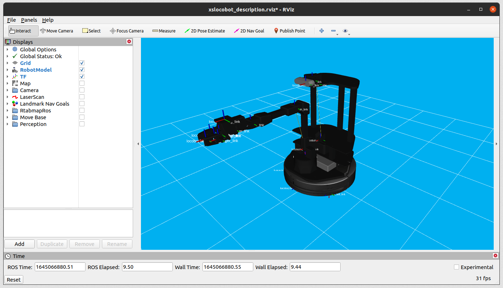

ROS 1 Quickstart Guide
======================

This guide is intended to get the use familiar with the basic functions and interfaces of the ROS
Interface.

1.  Get familiar with the physical robot rover (let's say... a LoCoBot WidowX-250 6DOF with lidar!) by executing the following command in a terminal ssh'ed into the LoCoBot:
    
        roslaunch interbotix_xslocobot_control xslocobot_control.launch robot_model:=locobot_wx250s use_base:=true use_camera:=true use_lidar:=true dof:=6
2.  Now, in a terminal on your remote computer (not via SSH), type:
    
        roslaunch interbotix_xslocobot_descriptions remote_view.launch
3.  RViz should appear on your remote computer and display a virtual real-time representation of the robot!
    
4.  By default, all the DYNAMIXEL motors in the robot are torqued on so it will be very difficult to manually manipulate them. To torque off all the motors, execute the command below in another terminal (either via SSH or on your remote computer).

    warning

    This command will cause the robot arm (if present) to collapse (if it's not already resting) so manually hold or secure it before executing.
    
        rosservice call /locobot/torque_enable "{cmd_type: 'group', name: 'all', enable: false}"

    note

    The command above torques off every motor in the ``all`` group. This is a special group
    that includes every DYNAMIXEL motor. To only torque off the arm motors, change the name
    from ``all`` to ``arm``. Likewise, to only torque off the motors controlling the camera,
    change the name from ``all`` to ``camera``.
    |Group Name|Servos in Group|
    |:----- |:----- |
    |``all``|Every DYNAMIXEL servo on the robot|
    |``arm``|All DYNAMIXEL servos on the arm excluding the gripper|
    |``camera``|All DYNAMIXEL servos in the camera pan & tilt mechanism|
5.  Now you should be able to freely manipulate the arm, gripper, and pan/tilt mechanism. Take note of how the RViz model accurately mimics the real robot. To make the robot hold a certain pose, manually hold the arm in the desired pose and execute the following command: 

        rosservice call /locobot/torque_enable "{cmd_type: 'group', name: 'all', enable: true}"
6.  You can now let go and observe how the arm and pan/tilt mechanism stay in place.
7.  Now let's visualize the sensor output! In the RViz window, check the **Camera** and **LaserScan** (if you have a lidar) displays and adjust the topic names as necessary. You should see image data from the camera streaming in the lower left corner of the window, and small red pixels being displayed in the RViz grid from the lidar.
8.  To move the base with a translational velocity of 0.5 m/s and angular velocity of 0.3 rad/s, type the following in another terminal:

    warning

    This command will cause the base to drive forward and to its left for around three seconds.
    Make sure there is nothing in the robot's path before running it.
    
        rostopic pub --once /mobile_base/cmd_vel geometry_msgs/Twist '{linear: {x: 0.5, y: 0.0, z: 0.0}, angular: {x: 0.0, y: 0.0, z: 0.3}}'
9.  You can stop the base's movement at any time by pressing ``Ctrl`` + ``C`` the publisher's terminal.
10. Shutdown all nodes by pressing ``Ctrl`` + ``C`` in the terminal where you started the launch file.

    note

    The remote installation script sets the ``ROS_MASTER_URI`` variable in your remote computer's
    ``~/.bashrc`` file to ``http://locobot.local:11311``. When working with the LoCoBot, this line
    (towards the bottom of the file) should be uncommented. Otherwise, you should comment it out so
    that you can run ROS on your remote computer normally.
