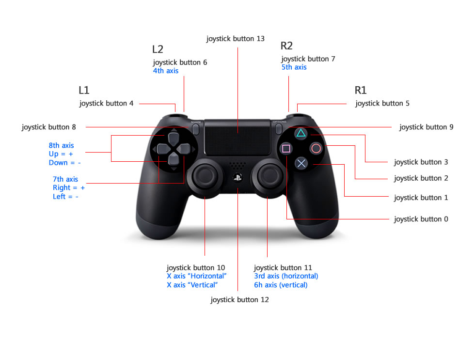
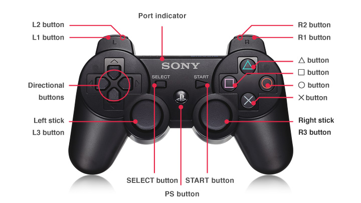

# Usage of commands
Below we show you the command you can use in order to manipulate the robot.

## Control by Joystick Controller

### Pairing Your Controller
The first thing required is pairing the controller with the LoCoBot's NUC computer. Here we have the PS4 Controller:
1. Click the **Bluetooth** icon on the top right of your screen, followed by **Bluetooth Settings**.
2. Press and hold the **Share** button on the PS4 controller (see image below for reference).
3. While holding the **Share** button, press and hold the **PS Button**. After a few seconds, the triangular shaped LED located between the **L2** and **R2** buttons should start rapidly flashing white (about twice a second) at which point you can let go.
4. On the computer, click the + icon in the Bluetooth settings window.
5. Wait until you see **Wireless Controller** pop up, select it, and click **Next** on the bottom right of the window.
6. A message should display saying **successfully set up new device 'Wireless Controller'** and the LED should turn blue. This means the controller is connected to the computer.
7. To disconnect, hold down the **PS Button** for about 10 seconds until the LED turns off.
8. To reconnect, just press the **PS Button** (no need to hold it down). After blinking white a few times, the LED should turn blue.



### Commands:
After successful pairment, you can use the controller to control the robot, e.g. the arm, the base and also the perception unit.  

The command is: 
```
roslaunch interbotix_xslocobot_joy xslocobot_joy.launch robot_model:=locobot_wx250s
```

A red error message might appear in the screen saying Couldn't open joystick force feedback!. This is normal and will not affect the joystick operation. To further customize the launch file at run-time, look at the table below:

| Argument | Description | Default Value |
|  :-----  |    :----    |     :----     |
| robot_model | model type of the Interbotix LoCoBot such as 'locobot_base' or      'locobot_wx250s' | "" |
| robot_name | name of the robot (could be anything but defaults to 'locobot')	 | "locobot" |
| use_rviz | launches RViz; if you are SSH'd into the robot, DON'T set this to true | false |
|rviz_frame |fixed frame in RViz; this should be changed to map or <robot_name>/odom if mapping or using local odometry respectively |$(arg robot_name)/odom |
|use_base|if true, the base ROS nodes are launched|true|
|use_lidar|if true, the RPLidar node is launched	|false|
|show_lidar|set to true if the lidar is installed on the robot; this will load the lidar related links to the 'robot_description' parameter	|$(arg use_lidar)|
|use_camera|if true, the RealSense D435 camera nodes are launched|false|
|threshold|value from 0 to 1 defining joystick sensitivity; a larger number means the joystick should be less sensitive	|0.75|
|controller|type of PlayStation controller ('ps3' or 'ps4')	|ps4|
|mode_configs|the file path to the 'mode config' YAML file	|refer to xslocobot_joy.launch|
|use_sim|if true, the DYNAMIXEL simulator node is run; use RViz to visualize the robot's motion; if false, the real DYNAMIXEL driver node is run	|false|

To understand how the joystick buttons map to controlling the robot, look at the diagram and table below:



#### Base Control Mode
|Button|Action|
|:----- |:----- |
|Left|stick Up/Down drive the base forward/backward between 0.7 to -0.7 m/s|
|R2|rotate the base clockwise between 0 and -3.14 rad/s|
|L2|rotate the base counterclockwise between 0 and 3.14 rad/s|
|SELECT/SHARE	|Reset the odometry of the base to an 'x', 'y', and 'theta' of 0 (the base chirps as well)|
|Right|stick Up/Down tilt the RealSense camera Up/Down|
|Right|stick Left/Right pan the RealSense camera Left/Right|
|START/OPTIONS	|move the pan/tilt servo to '0' radians|

#### Arm Control Mode
|Button|Action|
|:----- |:----- |
|START/OPTIONS	|move robot arm to its Home pose|
|SELECT/SHARE	|move robot arm to its Sleep pose|
|R2|rotate the 'waist' joint clockwise|
|L2|rotate the 'waist' joint counterclockwise|
|Triangle|increase gripper pressure in 0.125 step increments (max is 1)|
|X|decrease gripper pressure in 0.125 step increments (min is 0)|
|O|open gripper|
|Square	|close gripper|
|Right|stick Up/Down increase/decrease pitch of the end-effector|
|Right|stick Left/Right increase/decrease roll of the end-effector|
|R3|reverses the Right stick Left/Right control|
|Left|stick Up/Down move the end-effector (defined at 'ee_gripper_link') vertically in Cartesian space|
|Left|stick Left/Right move the end-effector (defined at 'ee_gripper_link') horizontally in Cartesian space|
|L3|reverses the Left stick Left/Right control|
|R1|if the arm has 6dof, this moves the end-effector in a negative direction along its own 'y' axis|
|L1|if the arm has 6dof, this moves the end-effector in a positive direction along its own 'y' axis|

#### Both Modes
|Button|Action|
|:----- |:----- |
|D-pad Up	|increase the control loop rate in 1 Hz step increments (max of 40)|
|D-pad Down	|decrease the control loop rate in 1 Hz step increments (min of 10)|
|D-pad Left	|'coarse' control - sets the control loop rate to a user-preset 'fast' rate|
|D-pad Right	|'fine' control - sets the control loop rate to a user-preset 'slow' rate|
|PS	|shift to the other Control Mode|

## Control by MoveIt Motion Planning
Here we use MoveIt Motion Planning to control the **arm** of the robot. If you also want to control the base to let the robot move, you can use [teleop_twist_keyboard](https://github.com/ros-teleop/teleop_twist_keyboard). You can install this by running the command:
```
sudo apt-get install ros-noetic-teleop-twist-keyboard
```
Run this command to use the teleop to control:
```
rosrun teleop_twist_keyboard teleop_twist_keyboard.py cmd_vel:=locobot/cmd_vel
```
### Use physical robot

```
roslaunch interbotix_xslocobot_moveit xslocobot_moveit.launch robot_model:=locobot_wx250s use_actual:=true dof:=6
```

### Use Gazebo Simulation
```
roslaunch interbotix_xslocobot_moveit xslocobot_moveit.launch robot_model:=locobot_wx250s show_lidar:=true use_gazebo:=true
```
**Since by default, Gazebo is started in a 'paused' state (this is done to give time for the controllers to kick in), unpause the physics once it is fully loaded by typing:**
```
rosservice call /gazebo/unpause_physics
```
Once the MoveIt GUI is fully loaded, take a look at the available planning groups. There should be two of them - one called 'interbotix_arm' and the other called 'interbotix_gripper'. The 'interbotix_arm' group contains the joints needed to plan the trajectories for the whole arm (excluding the gripper) while the 'interbotix_gripper' group contains the joints needed to plan the trajectories for the gripper (based on the linear distance from the 'right_finger_link' to the 'fingers_link'). There are a few saved poses for each of these groups that be executed such as 'home', 'sleep', and 'upright' poses for the 'interbotix_arm' group, and 'open', 'close', and 'home' for the 'interbotix_gripper' group ('home' just moves the gripper such that the angular position of the motor is at 0 radians). Also, it should be noted that the gripper frame of reference is located at the 'ee_gripper_link'.

Additionally, by default, the MoveIt GUI does not display the green or orange robots that represent the start and goal states for the arm respectively. To display them, navigate to the MotionPlanning -> Planning Request dropdown in RViz and check the Query Start State and Query Goal State checkboxes.

