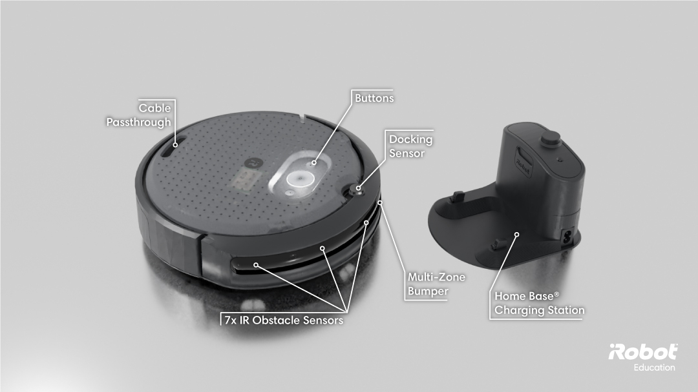
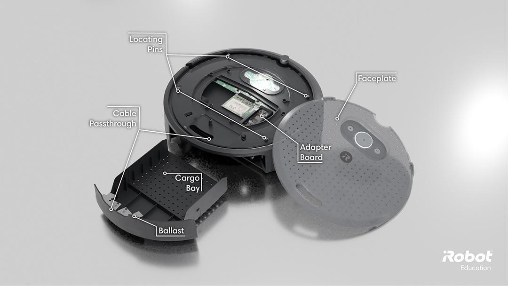
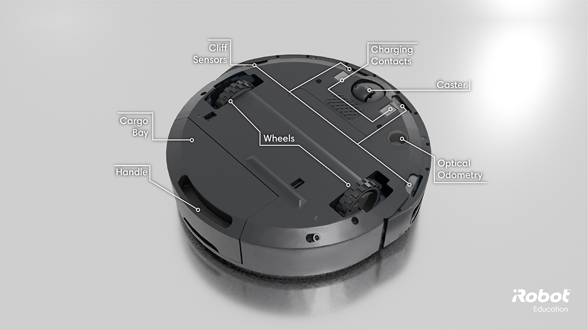
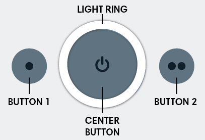
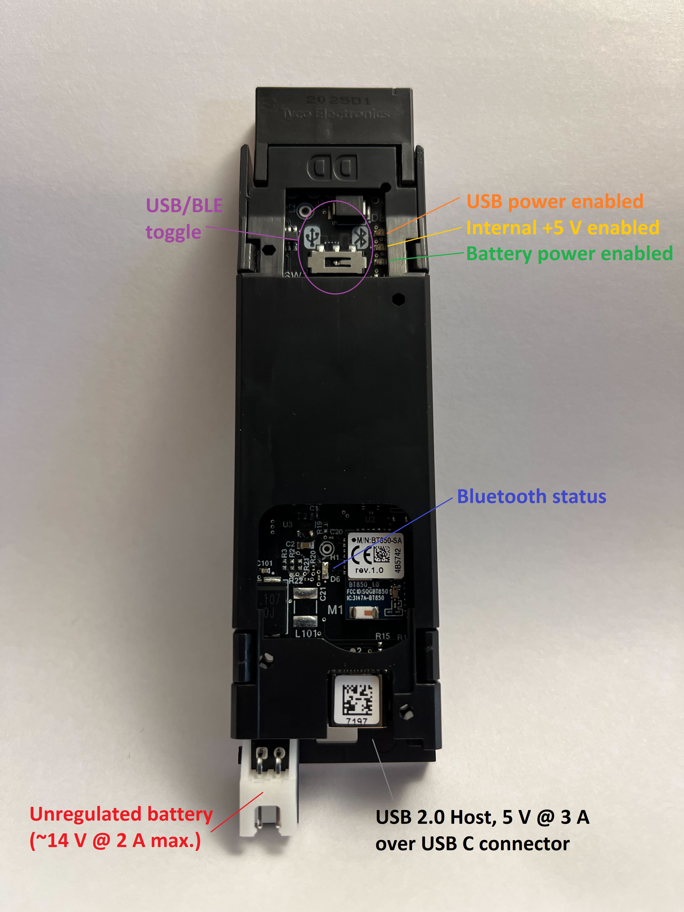

# Create 3 Move Base

iRobot Create 3 is an affordable, mobile robotics platform for educators, students, and developers.

The robot has a full suite of on-board sensors and actuators which will allow you to develop and test your robotics algorithms.

The software is entirely based on ROS 2: all sensors data are produced through ROS 2 publications while ROS 2 servers and subscriptions are used to control actuators and respond to users requests. The robot also provides some autonomous behaviors out of the box, such as docking, wall-follow and reactions to obstacles. All these can be triggered and/or configured through ROS 2 actions and parameters. **In order to use it on LoCoBot, they provide a ros_bridge from ros noetic to ros2 galactic.**

## Hardware

There are 2 components for the Create 3 robot: the robot itself and a charging dock station.



The top of the robot contains three buttons which can all be overloaded by a ROS 2 application. The power button features a ring of six RGB LEDs for indication. The faceplate and cargo bay of the robot feature a regular hole pattern for attaching payloads and can be removed without tools for quick prototyping. There are two cable passthroughs: one on the top edge of the cargo bay which is good for quick prototyping and one that penetrates the top cover and faceplate which is useful for keeping wires within the radius of the robot.



The bottom of the robot includes four cliff sensors to keep the robot on solid ground, a front caster (by default, the robot's center of gravity is forward of the center axis), charging contacts, two wheels with current sensors and encoders, and an optical odometry sensor. 




### Buttons and Light Ring

The Create 3 has three buttons on its top face. These buttons expose core functionality of the robot, but can also be overridden by the user.



#### Button 1

Button 1 (to the left of center) is marked with a single dot (•). If held for ten seconds, the robot will go into "standby" mode, keeping its charging circuitry active, and continuing to power the payload. The robot can be placed on the dock to charge or to keep the payload alive in this mode. To wake the robot from standby, hold the center button for one second. Button presses can be accessed by the user in both ROS 2 and iRobot Education Bluetooth modes.

#### Button 2

Button 2 (to the right of center) is marked with two dots (••). This button is a user button only. Button presses can be accessed by the user in both ROS 2 and iRobot Education Bluetooth modes.

#### Center Button

The center button is marked with a power icon. If held for seven seconds, the robot will go into "storage mode," disconnecting its internal battery from the robot and its payload. When the robot is in storage mode, the only way to power it on is to place it on the dock. The button also contains a light ring on its circumference.

#### Light Ring

The center button contains a ring of six RGB LEDs which communicate state about the robot. The LEDs expose internal state information about the robot, but can also be overridden by the user. For detail information about the states of the light ring and represented status of the robot please visit the [website](https://iroboteducation.github.io/create3_docs/hw/face/)

#### There is a important part of the Create 3 robot: Adapter Board

The robot has two electrical connections exposed via the Adapter Board. The connections are accessible within the robot once the cargo bay is removed. The Adapter Board is also visible through the top cover of the robot, where its indicators are visible, and the USB/BLE toggle can be switched. In LoCoBot we use USB Mode to connect with the computer via a ethernet cable and a USB-C to Ethernet converter.



## Software

The Create 3 robot runs a configuration webserver for modifying settings of the robot. This is a separate process from its ROS 2 application; it is running regardless of the status of that application. The webserver can be accessed via the robot's usb0 (Ethernet over USB host), wlan0 (provisioned to an external access point), or wlan1 (robot as its own access point) interfaces. The robot has a fixed IP address of 192.168.186.2 over its usb0 interface, and a fixed IP address of 192.168.10.1 over its wlan1 interface. The robot will get an IP address over DHCP as served by your network on its wlan0 interface. The webserver is available over http (port 80) in a browser by navigating to its IP address on whichever interface is active.

### Setup

This section presents the default Interbotix configuration of the LoCoBot's Create® 3 base. This can be found on the Create® 3 webserver accessed through the LoCoBot's computer's web browser (Firefox, etc.) at `192.168.186.2/ros-config` if connected over the base's USB-Ethernet interface.

#### Main configuration
|Field|Interbotix Default Value|Notes|
|:----- |:----- |:----- |
|ROS 2 Domain ID|`0`|This value is typically left as the default if you do not have multiple ROS domains on the same network. See [ROS 2 Domain ID Documentation](https://docs.ros.org/en/rolling/Concepts/Intermediate/About-Domain-ID.html).|
|ROS 2 Namespace|`/mobile_base`|The value dictates the namespace under which all Create 3 nodes, topics, services, actions, and parameters will be, i.e. the `/tf` topic published by the base will be `/mobile_base/tf`.|
|RMW_IMPLEMENTATION|`rmw_fastrtps_cpp`|This value tells which RMW implementation to use. See [ROS 2 RMW Implementation Documentation](https://docs.ros.org/en/rolling/Concepts/Intermediate/About-Different-Middleware-Vendors.html).|
|Enable Fast DDS discovery server?||Left blank as the ROS 1 implementation does not use the Fast DDS discovery server.|
|Address and port of Fast DDS discovery server||Left blank as the ROS 1 implementation does not use the Fast DDS discovery server.|

#### Application ROS 2 Parameters File
```
/mobile_base/motion_control:
  ros__parameters:
    safety_override: "full"
    reflexes_enabled: false
```
|Parameter|Type|Interbotix Default Value|Notes|
|:----- |:----- |:----- |:----- |
|/mobile_base/motion_control safety_override|String|`"full"`|Turns off all safety features. See [Create 3 safty override](https://iroboteducation.github.io/create3_docs/api/safety/) for more information.|
|/mobile_base/motion_control reflexes_enabled|Boolean|`false`|Turns off all reflexes. See [Create 3 Reflexes](https://iroboteducation.github.io/create3_docs/api/reflexes/) for more information.|